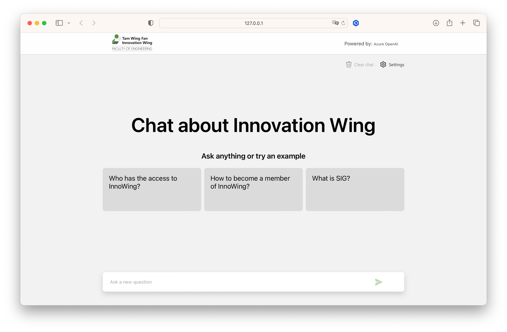
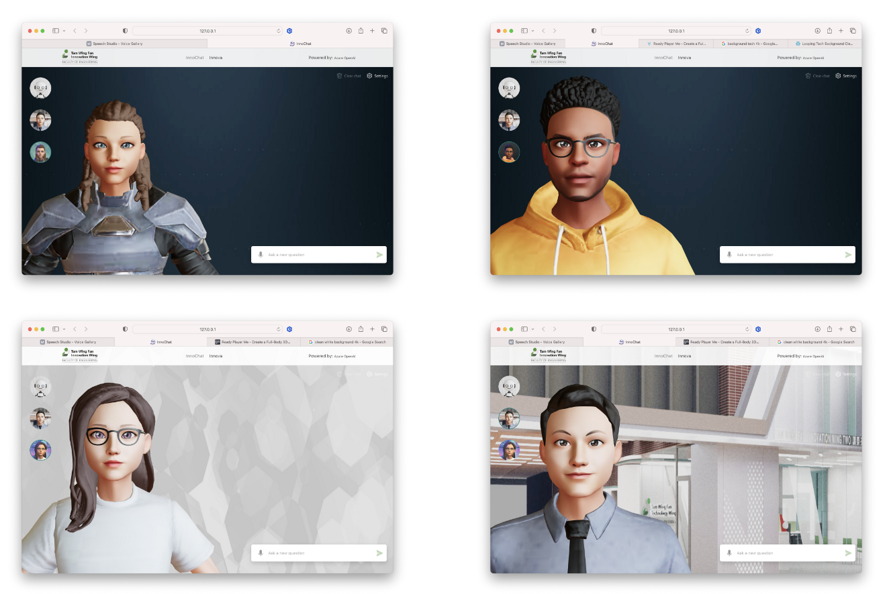
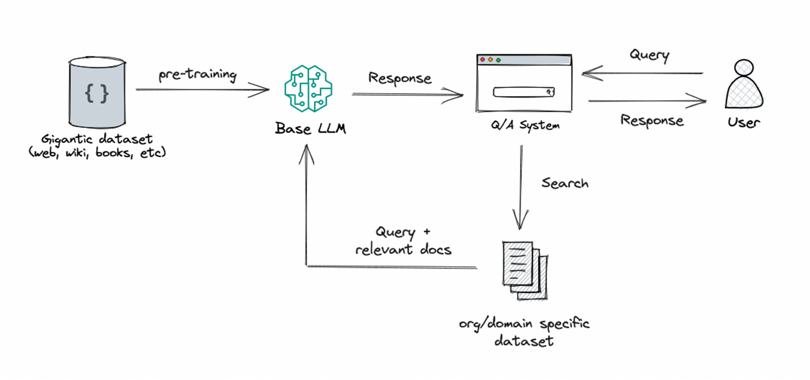
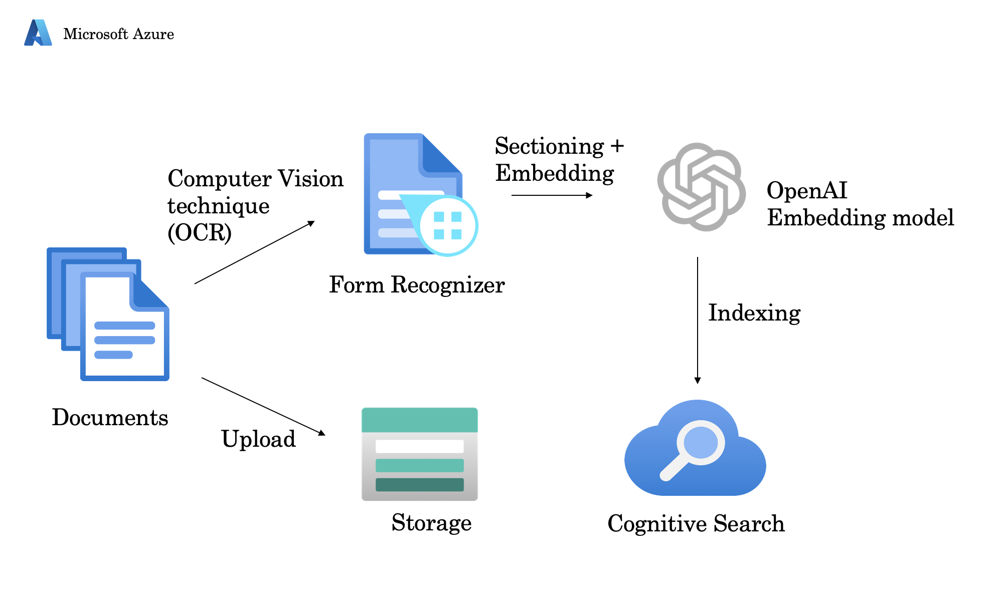
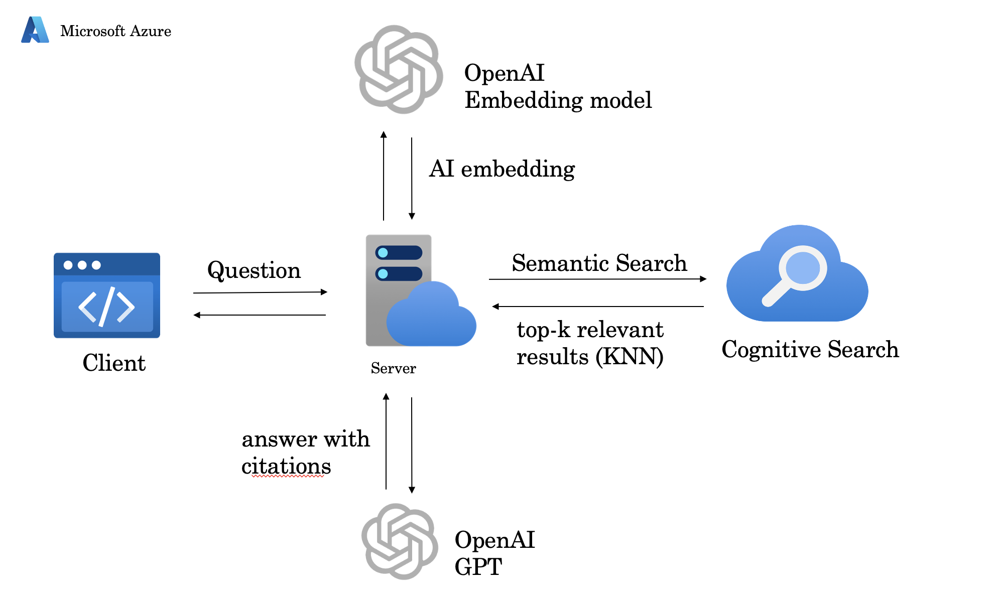

# Innochat template (ChatGPT + Custom Data)

This sample demonstrates an approach for creating ChatGPT-like experiences over your own data using the **Retrieval Augmented Generation** pattern. It uses Azure OpenAI Service to access the ChatGPT model (gpt-35-turbo), and Azure Cognitive Search for data indexing and retrieval. It also incorporate with speech services 3D avatars to provide a more interactive user experience.

## Workflow

##### RAG Pattern:

##### Incoporate with Custom Database:

##### Application workflow:

## Features

* ChatGPT style interface
* Speech input and output feature
* Incorperate with 3D avatars

## Getting Started

> **IMPORTANT:** In order to deploy and run this example, you'll need an **Azure subscription with access enabled for the Azure OpenAI service**. You can request access [here](https://aka.ms/oaiapply). You can also visit [here](https://azure.microsoft.com/free/cognitive-search/) to get some free Azure credits to get you started. This workshop will bu using the HKU Innowing Subscription account.

> **AZURE RESOURCE COSTS** by default this sample will create Azure App Service and Azure Cognitive Search resources that have a monthly cost, as well as Form Recognizer resource that has cost per document page. You can switch them to free versions of each of them if you want to avoid this cost by changing the parameters file under the infra folder (though there are some limits to consider; for example, you can have up to 1 free Cognitive Search resource per subscription, and the free Form Recognizer resource only analyzes the first 2 pages of each document.)

### Prerequisites

* [Python 3+](https://www.python.org/downloads/)
  * **Important**: Python and the pip package manager must be in the path in Windows for the setup scripts to work.
  * **Important**: Ensure you can run `python --version` from console. On Ubuntu, you might need to run `sudo apt install python-is-python3` to link `python` to `python3`.
* [Node.js](https://nodejs.org/en/download/)
* [Git](https://git-scm.com/downloads)
* [Powershell 7+ (pwsh)](https://github.com/powershell/powershell) - For Windows users only.
  * **Important**: Ensure you can run `pwsh.exe` from a PowerShell command. If this fails, you likely need to upgrade PowerShell.

## RUNNING

#### Setup Enviornment variables

| ENV_Var                  | Value        |
| ------------------------ | ------------ |
| AZURE_FORMRECOGNIZER_KEY |              |
| AZURE_OPENAI_KEY         |              |
| AZURE_SEARCH_INDEX       | vector-index |
| AZURE_SEARCH_KEY         |              |
|                          |              |

## Resources

* [Revolutionize your Enterprise Data with ChatGPT: Next-gen Apps w/ Azure OpenAI and Cognitive Search](https://aka.ms/entgptsearchblog)
* [Azure Cognitive Search](https://learn.microsoft.com/azure/search/search-what-is-azure-search)
* [Azure OpenAI Service](https://learn.microsoft.com/azure/cognitive-services/openai/overview)

### FAQ

***Question***: Why do we need to break up the PDFs into chunks when Azure Cognitive Search supports searching large documents?

***Answer***: Chunking allows us to limit the amount of information we send to OpenAI due to token limits. By breaking up the content, it allows us to easily find potential chunks of text that we can inject into OpenAI. The method of chunking we use leverages a sliding window of text such that sentences that end one chunk will start the next. This allows us to reduce the chance of losing the context of the text.
